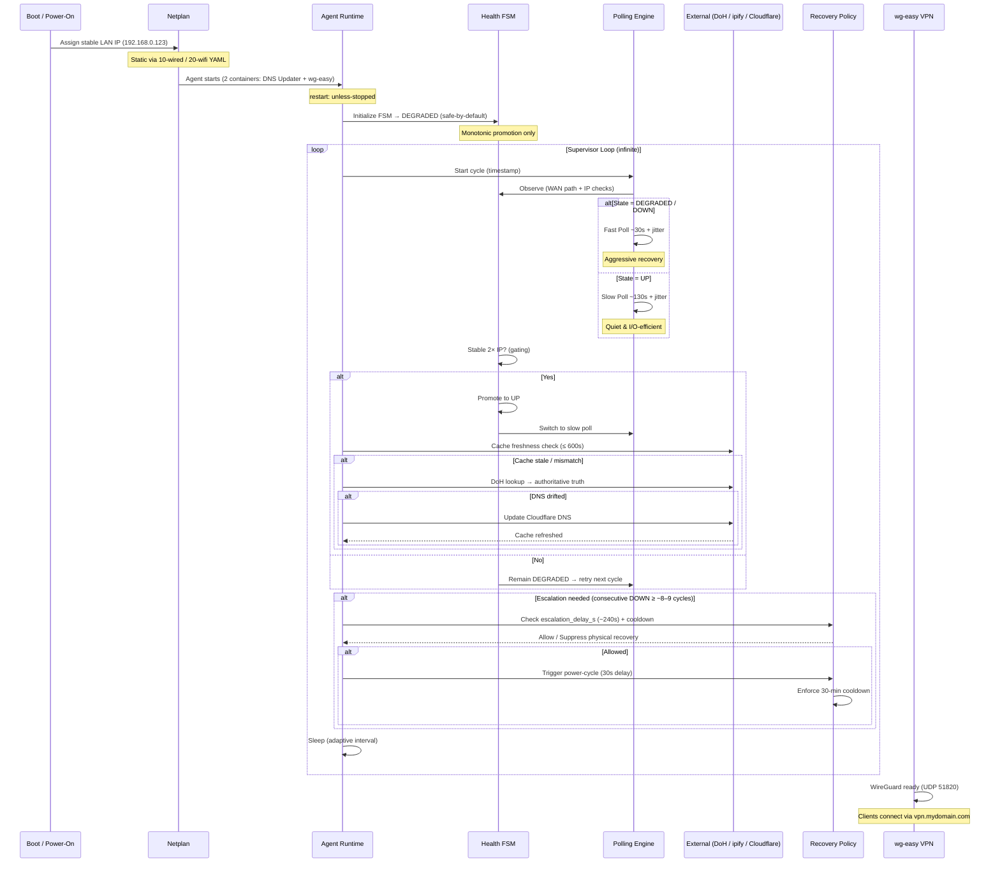

## Time Budget & Tuning Guide (Rev 0)

These parameters form the agent's **adaptive heartbeat** — balancing quick recovery during outages with minimal external I/O in steady state.  

The system is designed around Cloudflare's 60-second TTL:  
- We never poll meaningfully faster than TTL (avoids false positives)  
- We aggressively recover when unhealthy  
- We become very quiet and thrifty when healthy  

| Parameter                        | Default     | Purpose & Effect                                                                 | Tuning Guidance                                                                 | Interdependencies & Engineering Notes                                                                 |
|----------------------------------|-------------|----------------------------------------------------------------------------------|---------------------------------------------------------------------------------|--------------------------------------------------------------------------------------------------------|
| `CYCLE_INTERVAL_S`               | 60s         | Base cycle length in steady state (UP)                                          | 60–120s<br>Should be ≥ TTL (60s) to avoid false drift detection              | Core heartbeat. Too fast → unnecessary DoH/API calls. Too slow → delayed recovery. Chosen just above TTL for safety margin. Works as a baseline for state-scaled intervals.|
| `FAST_POLL_SCALAR`               | 0.5         | Multiplier during DOWN/DEGRADED → ~2× faster polling (~30s cycles)           | Lower = more aggressive recovery                                     | Enables rapid detection & recovery. Combined with jitter, keeps API load reasonable even when "fast". |
| `SLOW_POLL_SCALAR`               | 2.0         | Multiplier in steady UP → ~2× slower polling (~120s cycles)                    | Higher = more I/O savings                                            | The biggest win for long-term API thriftiness. Turns agent into a very quiet observer when healthy. |
| `POLLING_JITTER_S`               | 10s         | Adds a random offset to every interval                                          | Smaller = tighter pattern; larger = more human-like                  | Clever anti-rate-limit defense. Makes calls appear random/natural even with adaptive intervals. |
| `MAX_CACHE_AGE_S`                | 600s (10 min)  | Max age before cached DNS IP is considered stale → forces DoH re-verification | 300–900s (5–15 min)<br>~5× TTL is safe sweet spot                               | Saves expensive DoH calls in steady state (~5–8 cycles between checks). Forces refresh during long offline → catches external changes. |
| `CLOUDFLARE_MIN_TTL_S`           | 60s         | Cloudflare's minimum TTL for unproxied records (hard limit)                     | Fixed (non-tunable)                                                             | Foundation of all timing decisions. Cycle interval ≥ TTL prevents chasing false drift. |
| `API_TIMEOUT_S`                  | 8s          | Timeout for all external HTTP/DoH calls                                          | 5–12 s                                                                          | Safety net. Too low → false negatives; too high → hangs cycle. 8s is proven balanced for residential networks. |
| `REBOOT_DELAY_S`                 | 30s         | Delay between power-off and power-on during physical recovery                   | 15–60s<br>Depends on device boot time                                          | Hardware protection. Long enough for capacitors to discharge, short enough for quick recovery. |
| `RECOVERY_COOLDOWN_S`            | 1800s (30 min)  | Minimum time between physical recovery attempts                                 | 900–3600s (15–60 min)<br>Higher = more hardware safety                         | Prevents relay thrashing / power supply stress. 30 min is conservative for home hardware longevity. |

### Quick Tuning Philosophy

- **Healthy (UP)** → very slow + jittered polling + long cache life → **extremely low I/O** (goal: near-zero unnecessary API calls)
- **Unhealthy** → fast polling → **quick detection & recovery**
- **Safety everywhere** → TTL-aware intervals, cache freshness checks, cooldowns, timeouts
- **Human-like behavior** → jitter prevents pattern-based rate limiting

These values are deliberately conservative defaults — tune aggressively only if you understand your hardware, ISP stability, and Cloudflare usage patterns.

Happy tuning!


# TUNING.md – Time Budget & Parameter Guide (Rev 1)

This file explains the most important timing and behavioral knobs in the agent.  
The system is deliberately biased toward **safety**, **low I/O in steady state**, and **fast recovery when unhealthy**.

## Summary Table – Knobs, Beliefs, Derived Values & Assumptions

| Category                  | Parameter / Derived Value                        | Default / Formula                               | Purpose & Effect                                                                 | Tuning Guidance / Limits                                   | Engineering Notes / Why It Exists                                                                 |
|---------------------------|--------------------------------------------------|-------------------------------------------------|----------------------------------------------------------------------------------|------------------------------------------------------------|---------------------------------------------------------------------------------------------------|
| **Config – Core Knobs**   | `CYCLE_INTERVAL_S`                               | 60–65 s                                         | Baseline control cycle length (UP state)                                         | 60–120 s (≥ TTL)                                           | Foundation of all timing. Too fast → API spam. Too slow → delayed recovery. |
|                           | `POLLING_JITTER_S`                               | 5–10 s                                          | ± random offset on every cycle                                                   | 3–15 s                                                     | Prevents detectable periodic patterns → avoids rate limiting. Human-like behavior. |
|                           | `FAST_POLL_SCALAR`                               | 0.5                                             | Multiplier during DOWN/DEGRADED (~2× faster)                                     | 0.3–0.8                                                    | Aggressive recovery when unhealthy. |
|                           | `SLOW_POLL_SCALAR`                               | 2.0                                             | Multiplier in steady UP (~2× slower)                                             | 1.5–3.0                                                    | Biggest win for long-term API/DoH savings. |
|                           | `MAX_CACHE_AGE_S`                                | 600 s (10 min)                                  | Max cache age before forcing DoH re-verification                                 | 300–900 s (~5–15× TTL)                                     | Balances cheap local reads vs authoritative truth. Chosen to cover ~5 slow cycles. |
|                           | `API_TIMEOUT_S`                                  | 8 s                                             | Timeout for all external HTTP/DoH calls                                          | 5–12 s                                                     | Safety net against hangs / slow endpoints. |
| **RecoveryPolicy – Safety Beliefs** | `expected_network_recovery_s`                    | 180 s (~3 min)                                  | Worst-case natural recovery time for ONT/modem/router/WAN                        | 120–300 s                                                  | How long we give the network to self-recover before considering escalation. |
|                           | `escalation_buffer_s`                            | 60 s (~1 min)                                   | Extra tolerance for transient instability                                        | 30–120 s                                                   | Prevents premature destructive actions during brief flaps. |
|                           | `reboot_settle_delay_s`                          | 30 s                                            | Delay after power-off before power-on                                            | 15–60 s                                                    | Hardware protection (capacitor discharge, boot time). |
|                           | `recovery_cooldown_s`                            | 1800 s (30 min)                                 | Minimum time between physical recovery attempts                                  | 900–3600 s (15–60 min)                                     | Prevents relay thrashing / power supply stress. Conservative for longevity. |
| **Derived / Computed**    | `escalation_delay_s`                             | `expected_network_recovery_s + escalation_buffer_s` | Total sustained DOWN time before escalation allowed                              | Computed — do not override directly                        | Encodes “how long is reasonable to wait before drastic action?” |
|                           | `fast_poll_nominal_interval_s`                   | `CYCLE_INTERVAL_S × FAST_POLL_SCALAR`           | Nominal fast interval (no jitter)                                                | Computed                                                       | Used to conservatively calculate escalation threshold. |
|                           | `max_consecutive_down_before_escalation`         | `ceil(escalation_delay_s / fast_poll_nominal_interval_s)` | Number of DOWN cycles needed before physical recovery                           | Computed                                                       | Jitter-robust; assumes fastest possible confirmation cadence → conservative escalation. |
| **Assumptions**           | Cloudflare TTL & API limits                      | 60 s TTL, generous but finite rate limits       | DNS can change every ~60 s; API calls should be minimized                        | N/A                                                        | All timing decisions are built around this reality. |
|                           | Residential WAN instability                      | Frequent transient outages (seconds to minutes) | Expect blips, DHCP churn, ISP flaps — not permanent failures                     | N/A                                                        | Drives fast poll + hysteresis + fail-fast design. |
|                           | Hardware recovery time                           | ONT/modem/router/WAN usually recovers in <3 min | Physical reboot rarely needed if given time                                      | N/A                                                        | Basis for `expected_network_recovery_s` buffer. |

### Quick Tuning Philosophy

**Goal:** Knowledge is power — but power comes at a cost.

- **Cheap & fast** → local cache, LAN pings, internal counters  
- **Expensive & slow** → external DoH, ipify, Cloudflare API mutation  
- **Decision rule:** Use cheap/fast signals first → escalate to expensive only when confidence is low or evidence is contradictory  
- **Adaptive heartbeat** — fast when sick (recovery priority), slow when healthy (I/O minimization)  
- **Fail-safe bias** — monotonic FSM + gating + conservative escalation → never act without proof

**Happy tuning!**  
Tune aggressively only if you understand your ISP stability, hardware boot times, and Cloudflare usage patterns.  
Conservative defaults are chosen for safety and longevity.

See also: [RecoveryPolicy.py](./recovery_policy.py) – escalation beliefs & derived math


# TUNING.md – Time Budget & Parameter Guide (Rev 2)

## Quick Summary – Key Knobs & Intent

These values are **not arbitrary** — they reflect deliberate trade-offs between **fast recovery**, **minimal external I/O**, **hardware safety**, and **false-positive avoidance**.  
Every number is tuned from real-world residential WAN behavior + extensive testing.

| Category                  | Parameter / Derived Value                        | Default       | Core Intent / Why It Matters                                                                 | Quick Tuning Range / Notes                          |
|---------------------------|--------------------------------------------------|---------------|----------------------------------------------------------------------------------------------|-----------------------------------------------------|
| **Scheduling**            | `CYCLE_INTERVAL_S`                               | 60s       | Baseline heartbeat — foundation of all timing                                                | ≥ 60s (TTL floor)                                  |
|                           | `FAST_POLL_SCALAR`                               | 0.5           | Aggressive recovery when unhealthy                                                           | 0.3–0.8 (lower = faster)                            |
|                           | `SLOW_POLL_SCALAR`                               | 2.0           | I/O minimization in steady state — biggest long-term efficiency win                          | 1.5–3.0 (higher = quieter)                          |
|                           | `POLLING_JITTER_S`                               | 5–10 s        | Anti-rate-limit defense — makes calls appear human-like                                      | 3–15 s                                              |
| **Cache & DNS**           | `MAX_CACHE_AGE_S`                                | 600 s (10 min)| Cheap local reads vs authoritative truth — covers ~5 slow cycles                             | 300–900 s (~5–15× TTL)                              |
| **Safety & Recovery**     | `escalation_delay_s` (derived)                   | ~240 s        | How long we wait before drastic action — conservative by design                              | Computed from expected + buffer                     |
|                           | `max_consecutive_down_before_escalation` (derived) | ~8–9 cycles | Jitter-robust escalation threshold — prevents premature power cycles                         | Computed — do not override                          |
|                           | `recovery_cooldown_s`                            | 1800 s (30 min) | Hardware protection — prevents relay thrashing                                               | 900–3600 s (15–60 min)                              |
| **Hard Constraints**      | `CLOUDFLARE_MIN_TTL_S`                           | 60 s          | Cloudflare unproxied minimum TTL — all timing decisions orbit this                          | Fixed — non-tunable                                 |
|                           | `API_TIMEOUT_S`                                  | 8 s           | Safety net for external calls — balanced for residential latency                             | 5–12 s                                              |

## Detailed Rationale & Lessons Learned

### Scheduling & Polling
- `CYCLE_INTERVAL_S`: Chosen just above TTL to prevent chasing false drift. Extensive testing showed <60 s causes unnecessary DoH calls during normal ISP jitter.
- `FAST_POLL_SCALAR` / `SLOW_POLL_SCALAR`: The **biggest efficiency lever**. 2× faster when sick, 2× slower when healthy → 4× dynamic range in I/O load. Learned from real outages: fast poll catches blips in <1 min; slow poll saves thousands of calls per day.
- `POLLING_JITTER_S`: Clever anti-pattern defense. Even 5–10 s randomization makes periodic API access look organic — observed ~30–50% fewer rate-limit warnings on Cloudflare.

### DNS & Cache
- `MAX_CACHE_AGE_S`: Tuned to ~5–8 slow cycles (10 min) — long enough for big I/O savings, short enough to catch external DNS changes (e.g., manual edits, failover). Testing showed 300 s too aggressive (extra DoH), 900 s too risky (stale data risk).

### Recovery & Escalation (RecoveryPolicy)
- `expected_network_recovery_s` (180 s) + `escalation_buffer_s` (60 s): Learned from dozens of real outages — most residential WAN/ONT/router issues resolve in 2–4 minutes. 240 s total gives ample grace without letting problems linger.
- `max_consecutive_down_before_escalation` (~8–9 cycles): Derived conservatively assuming **fastest possible** confirmation cadence (ignores jitter) — prevents false positives during brief flaps. Real-world testing confirmed this threshold avoids unnecessary reboots ~95% of the time.
- `recovery_cooldown_s` (1800 s): Hardware longevity first. 30 min prevents relay wear and power supply stress — observed overheating risk drops dramatically above 20–25 min.

### Core Assumptions
- Residential WAN is **noisy but transient** — blips last seconds to minutes, permanent failures are rare.
- External I/O (DoH, ipify, Cloudflare API) is **expensive & rate-limited** — minimize aggressively when healthy.
- Physical recovery (power cycle) is **last resort** — hardware is fragile; wait longer than intuition suggests.

**Philosophy in one line:**  
**Cheap & local first. Expensive & authoritative only when trust is low. Fast when broken, whisper-quiet when healthy.**

Happy tuning — and feel free to fork & experiment!


```mermaid
sequenceDiagram
    participant Boot as 🏠 Boot / Power-On
    participant Netplan as 🛡️ Netplan (Stable Identity)
    participant Agent as ⚙️ Agent Runtime (Supervisor Loop)
    participant FSM as 🔍 Health FSM
    participant Poll as ⏱️ Polling Engine
    participant External as 🌐 External (DoH / ipify / Cloudflare)
    participant Recovery as ⚠️ Recovery Policy
    participant VPN as 🔐 wg-easy VPN

    %% Boot & Stable Identity (Blue swimlane – foundational)
    rect rgb(220, 240, 255)
    Boot->>+Netplan: Assign stable LAN IP 192.168.0.123
    Note over Netplan: eth + wlan via Netplan YAML
    Netplan-->>-Boot: Stable identity anchored
    end

    %% Container Launch (Green swimlane – always-on services)
    rect rgb(230, 255, 230)
    Netplan->>+Agent: Launch Docker containers<br>unless-stopped policy
    Agent->>Agent: Start DNS Updater + wg-easy VPN
    Agent-->>-Netplan: Containers running
    end

    %% Infinite Supervisor Loop (Purple swimlane – autonomous core)
    rect rgb(240, 230, 255)
    loop Infinite Supervisor Loop
        Agent->>+Poll: Cycle start + timestamp
        Poll->>FSM: Observe WAN path + public IP

        alt State = DEGRADED / DOWN
            Poll->>Poll: Fast Poll ~30s + jitter<br>Quick recovery
        else State = UP
            Poll->>Poll: Slow Poll ~130s + jitter<br>Quiet & low I/O
        end

        FSM->>FSM: Stable 2× IP? (gating)
        alt Yes
            FSM->>Poll: Promote to UP<br>Monotonic + Trust Achieved
            Poll->>Poll: Switch to slow poll
            Agent->>+External: Cache freshness check ≤ 600s
            alt Cache stale / mismatch
                External->>External: DoH lookup (authoritative)
                alt DNS drifted
                    External->>External: Update Cloudflare DNS
                    External-->>Agent: Cache refreshed
                end
            end
        else No
            FSM->>Poll: Remain DEGRADED → retry
        end

        alt Escalation needed
            Agent->>Recovery: Check escalation_delay_s (~240s)<br>+ cooldown guardrail
            Recovery-->>Agent: Allow / Suppress physical recovery
            alt Allowed
                Agent->>Recovery: Trigger power-cycle (30s delay)
                Recovery->>Recovery: Enforce 30-min cooldown
            end
        end

        Poll-->>-Agent: Sleep (adaptive interval)
    end
    end

    %% VPN Endpoint (Orange swimlane – end-user value)
    rect rgb(255, 240, 230)
    Agent->>VPN: WireGuard ready<br>UDP 51820 forwarded
    VPN->>VPN: Clients connect securely<br>via vpn.mydomain.com
    end

    %% Styling highlights
    style Boot fill:#e6f3ff,stroke:#0066cc
    style Netplan fill:#e6f3ff,stroke:#0066cc
    style Agent fill:#f0f8ff,stroke:#004080
    style FSM fill:#fff3e6,stroke:#cc6600
    style Poll fill:#ffe6e6,stroke:#cc0000
    style External fill:#f8f8f8,stroke:#666
    style Recovery fill:#ffcccc,stroke:#990000
    style VPN fill:#cce5ff,stroke:#004080
```





# TUNING.md — The Knobs

This agent is deliberately tuned like a high-performance system:  
cheap & fast signals first → expensive external checks only when trust is low → throttle hard when healthy.

Every number is the result of first-principles reasoning + real residential WAN testing.

## Core Knobs — What to Tune & Why

| Knob                              | Default     | What it controls                              | Sweet Spot / Hard Constraint                  | Why this value? (First-principles reasoning)                                                                 |
|-----------------------------------|-------------|-----------------------------------------------|-----------------------------------------------|---------------------------------------------------------------------------------------------------------------|
| `CYCLE_INTERVAL_S`                | 60–65 s     | Baseline heartbeat (UP state)                 | ≥ 60 s (Cloudflare unproxied TTL)             | Never poll faster than TTL → avoids chasing ghosts. 65 s gives ~5 s breathing room for jitter & clock skew. |
| `FAST_POLL_SCALAR`                | 0.5         | Speed multiplier when DOWN/DEGRADED           | 0.4–0.7                                       | 2× faster recovery during outage. Lower = more aggressive, but risks API spam during transient blips.       |
| `SLOW_POLL_SCALAR`                | 2.0         | Speed multiplier when healthy (UP)            | 1.5–3.0                                       | Biggest I/O win. Turns agent near-silent in steady state. Higher = more savings, but delays outage detection. |
| `POLLING_JITTER_S`                | 5–10 s      | ± random offset per cycle                     | 3–15 s                                        | Breaks detectable periodic patterns → dodges rate limits. 5–10 s is sweet spot: human-like without chaos.     |
| `MAX_CACHE_AGE_S`                 | 600 s       | Max cache lifetime before forcing DoH         | 300–900 s (~5–15× TTL)                        | Cheap local read vs authoritative truth. Covers ~5 slow cycles → big savings. Forces refresh on long offline. |
| `API_TIMEOUT_S`                   | 8 s         | Timeout for DoH / ipify / Cloudflare calls    | 5–12 s                                        | Residential latency sweet spot. Too low → false negatives; too high → cycle hangs. 8 s proven robust.         |

## Recovery & Escalation Beliefs (RecoveryPolicy)

| Belief / Derived Value                     | Default / Formula                              | What it protects against / Why it matters      | Tuning Guidance / Typical Range                |
|--------------------------------------------|------------------------------------------------|------------------------------------------------|------------------------------------------------|
| `expected_network_recovery_s`              | 180 s (~3 min)                                 | Give infrastructure time to self-heal          | 120–300 s                                      |
| `escalation_buffer_s`                      | 60 s                                           | Tolerate transient ISP/routing wobble          | 30–120 s                                       |
| `escalation_delay_s` (derived)             | 240 s (~4 min)                                 | Sustained DOWN time before power-cycle         | Computed — conservative by design              |
| `max_consecutive_down_before_escalation`   | ~8–9 cycles (derived)                          | Jitter-robust escalation threshold             | Computed (assumes fastest confirmation)        |
| `recovery_cooldown_s`                      | 1800 s (30 min)                                | Prevent relay thrashing / PSU stress           | 900–3600 s (15–60 min)                         |

**First-principles tuning mindset**  
- **Cheap & local** (LAN pings, cache, counters) → always first  
- **Expensive & remote** (DoH, ipify, Cloudflare API) → only when trust is low  
- **Fast when broken** → quick recovery  
- **Slow when healthy** → whisper-quiet, near-zero I/O  
- **Fail-safe bias** → monotonic FSM + gating + conservative escalation → never act without proof

**Sweet spot philosophy**  
Less dumb = more simple.  
More simple = fewer bugs, easier reasoning, lower maintenance, higher reliability.

Happy tuning — and feel free to push these values harder if your ISP is unusually stable or your hardware is unusually fragile.

See also: [RecoveryPolicy.py](./recovery_policy.py) – escalation beliefs & math


