```mermaid
graph TD
    A[Boot] --> B[Netplan → stable IP 192.168.0.123]
    B --> C[Agent starts]
    C --> D[FSM in DEGRADED]
    D --> E[Observe 30–130s cycles]
    E --> F[WAN + IP stability checks]
    F -->|Yes| G[Stable 2× IP?]
    G -->|Yes ──►| H[Promote to UP]
    H --> I[Cache seeded + DNS reconciled]
    I --> J[WireGuard ready]
    J --> K[Clients connect via vpn.mydomain.com]
```

# Adaptive Home Network Stack 🏠🔒🚀
**Always-on Mini-PC VPN + Auto DNS Reconciliation**

Minimal, resilient, self-healing remote access setup.  
One mini PC → WireGuard VPN + dynamic Cloudflare DNS.  
Router is disposable. Clients never notice changes.

## Architecture Layers (Clean Separation of Concerns)

| Layer              | Responsibility                          |
|--------------------|-----------------------------------------|
| Mini PC            | Stable LAN IP (192.168.0.123)           |
| Router             | NAT + 2–3 port forwards                 |
| Cloudflare DNS     | vpn.mydomain.com → current public IP    |
| Clients            | Connect via DNS name                    |

## Core Components & Workflow

1. **Mini PC** (always-on, low-power: Intel N100/Beelink/etc.)
   - Ubuntu Server 24.04 LTS
   - Static IP via Netplan (Ethernet primary + Wi-Fi fallback)
   - Two Docker containers:
     - `update_dns` (custom agent): monitors public IP → updates Cloudflare
     - `wg-easy`: WireGuard server + web UI (kernel-space Layer 3 VPN)

2. **Netplan** – Rock-solid LAN identity
   - `10-wired.yaml`: metric 100 (preferred)
   - `20-wifi.yaml`: metric 600 or no default route (fallback)

3. **Dynamic DNS Agent** – The brain
   - Deterministic FSM: DOWN → DEGRADED → UP (monotonic, fail-fast)
   - Adaptive polling: ~30 s (unhealthy) vs ~130 s (healthy)
   - Cache-aware DoH + stability gating → minimizes Cloudflare API calls

4. **WireGuard (wg-easy)** – Fast & audited
   - UDP 51820 forwarded to mini PC
   - Web UI (TCP 51821, optional forward)
   - Clients: `vpn.mydomain.com:51820`

## Router Checklist (Minimal)

- LAN: 192.168.0.0/24
- Gateway: 192.168.0.1
- Forward:
  - UDP 51820 → 192.168.0.123:51820 (WireGuard)
  - TCP 51821 → 192.168.0.123:51821 (UI, optional)
  - TCP 22 → 192.168.0.123:22 (SSH, optional)

## Simplified Workflow
Boot ──► Netplan → stable IP 192.168.0.123
         │
         ▼
Agent starts ──► FSM in DEGRADED
         │
         ▼
Observe (30–130s cycles) ──► WAN + IP stability checks
         │
         ▼
Stable 2× IP? ──► Promote to UP
         │
         ▼
Cache seeded + DNS reconciled
         │
         ▼
WireGuard ready → clients connect via vpn.mydomain.com


```mermaid
flowchart TD
Boot ──► Netplan → stable IP 192.168.0.123
         │
         ▼
Agent starts ──► FSM in DEGRADED
         │
         ▼
Observe (30–130s cycles) ──► WAN + IP stability checks
         │
         ▼
Stable 2× IP? ──► Promote to UP
         │
         ▼
Cache seeded + DNS reconciled
         │
         ▼
WireGuard ready → clients connect via vpn.mydomain.com
```


## Simplified Workflow




```mermaid
graph TD
    A[Boot] --> B[Netplan → stable IP 192.168.0.123]
    B --> C[Agent starts]
    C --> D[FSM in DEGRADED]
    D --> E[Observe 30–130s cycles]
    E --> F[WAN + IP stability checks]
    
    F -->|No| E  %% loop back if unstable
    F -->|Yes| G[Stable 2× IP?]
    G -->|Yes| H[Promote to UP]
    G -->|No| E
    
    H --> I[Cache seeded + DNS reconciled]
    I --> J[WireGuard ready]
    J --> K[Clients connect via vpn.mydomain.com]

    %% Styling for highlights
    style A fill:#f9f,stroke:#333
    style J fill:#bbf,stroke:#333
```

```mermaid
---
title: Simplified Workflow
config:
   look: handDrawn
   theme: 'default'
---
graph TD
    A([Boot]) --> B([Netplan → stable IP 192.168.0.123])
    B --> C([Agent starts])
    C --> D([FSM in DEGRADED])
    D --> E([Observe 30–130s cycles])
    E --> F([WAN + IP stability checks])

    F --> G{Stable 2× IP?}
    G -->|Yes| H([Promote to UP])
    G -->|No| E  %% loop back for more observations

    H --> I([Cache seeded + DNS reconciled])
    I --> J([WireGuard ready])
    J --> K([Clients connect via vpn.mydomain.com])

    %% Optional visual highlights
    style A fill:#f9f,stroke:#333,stroke-width:2px,rx:10,ry:10
    style J fill:#bbf,stroke:#333,stroke-width:2px,rx:10,ry:10
```








```mermaid
---
title: Simplified Workflow
config:
   look: handDrawn
   theme: 'forest'
---
graph TD
    A([Boot]) --> B([Netplan → stable IP 192.168.0.123])
    B --> C([Agent starts])
    C --> D([FSM in DEGRADED])
    D --> E([Observe 30–130s cycles])
    E --> F([WAN + IP stability checks])

    F --> G{Stable 2× IP?}
    G -->|Yes| H([Promote to UP])
    G -->|No| E  
    
    %% loop back for more observations

    H --> I([Cache seeded + DNS reconciled])
    I --> J([WireGuard ready])
    J --> K([Clients connect via vpn.mydomain.com])

    %% Optional visual highlights
    style A fill:#f9f,stroke:#333,stroke-width:2px,rx:10,ry:10
    style J fill:#bbf,stroke:#333,stroke-width:2px,rx:10,ry:10
```

```mermaid
---
title: Simplified Workflow
config:
   look: handDrawn
   theme: 'forest'
---
graph TD
    %% Title & Styling
    A([Boot]) --> B([Netplan assigns stable LAN IP<br>192.168.0.123])

    B --> C{Agent starts<br>Two independent Docker containers}
    C -->|DNS Updater| D[Tracks & publishes public IP]
    C -->|wg-easy VPN| E[WireGuard kernel-space Layer 3 VPN]

    subgraph "Core Control Loop (The Brain)"
        D --> F([FSM initializes in DEGRADED<br>probationary / safe-by-default])
        F --> G[Observe cycle<br>30–130s + jitter<br>Fast Poll when unhealthy]
        G --> H[WAN path + public IP checks]
        H --> I{Stable 2× IP?}
        I -->|No → loop| G
        I -->|Yes| J[Promote to UP<br>monotonic + fail-fast]
        J --> K[Switch to Slow Poll<br>~120s cycle + jitter<br>quiet & efficient]
        J --> L[Cache freshness check<br>age ≤ 600s]
        L --> M[Cache seeded / refreshed<br>only after authoritative confirmation]
        M --> N[DNS reconciled<br>if drift detected]
    end

    N --> O[WireGuard ready<br>UDP 51820 forwarded]
    O --> P[Clients connect securely<br>via vpn.mydomain.com]

    %% Styling for visual impact
    style A fill:#e6f3ff,stroke:#0066cc,stroke-width:2px,rx:12,ry:12
    style J fill:#ccffcc,stroke:#006600,stroke-width:2px,rx:12,ry:12
    style O fill:#cce5ff,stroke:#004080,stroke-width:2px,rx:12,ry:12
    style P fill:#fff0e6,stroke:#cc6600,stroke-width:2px,rx:12,ry:12

    %% Link styling
    linkStyle default stroke:#0066cc,stroke-width:2px
```

## Why It Works So Well

- Router swap = 2 minutes of port forwards
- Mini PC replacement = copy config + same IP
- IP change = agent detects & updates DNS in <2 minutes
- No third-party DDNS → full control
- Fail-safe by design → monotonic FSM + gating
- Extremely low I/O in steady state → adaptive + jitter + cache

**Happy remote-accessing!**

See also:  
- [TUNING.md](./TUNING.md) – parameter guide  
