```mermaid
---
title: Simplified Workflow
config:
   look: handDrawn
   theme: 'forest'
---
graph TD
    A([Boot]) --> B([Netplan → stable IP 192.168.0.123])
    B --> C([Agent starts])
    C --> D([FSM in DEGRADED])
    D --> E([Observe 30–130s cycles])
    E --> F([WAN + IP stability checks])

    F --> G{Stable 2× IP?}
    G -->|Yes| H([Promote to UP])
    G -->|No| E  
    
    %% loop back for more observations

    H --> I([Cache seeded + DNS reconciled])
    I --> J([WireGuard ready])
    J --> K([Clients connect via vpn.mydomain.com])

    %% Optional visual highlights
    style A fill:#f9f,stroke:#333,stroke-width:2px,rx:10,ry:10
    style J fill:#bbf,stroke:#333,stroke-width:2px,rx:10,ry:10
```

```mermaid
---
title: Simplified Workflow
config:
   look: handDrawn
   theme: 'forest'
---
graph TD
    %% Title & Styling
    A([Boot]) --> B([Netplan assigns stable LAN IP<br>192.168.0.123])

    B --> C{Agent starts<br>Two independent Docker containers}
    C -->|DNS Updater| D[Tracks & publishes public IP]
    C -->|wg-easy VPN| E[WireGuard kernel-space Layer 3 VPN]

    subgraph "Core Control Loop (The Brain)"
        D --> F([FSM initializes in DEGRADED<br>probationary / safe-by-default])
        F --> G[Observe cycle<br>30–130s + jitter<br>Fast Poll when unhealthy]
        G --> H[WAN path + public IP checks]
        H --> I{Stable 2× IP?}
        I -->|No → loop| G
        I -->|Yes| J[Promote to UP<br>monotonic + fail-fast]
        J --> K[Switch to Slow Poll<br>~120s cycle + jitter<br>quiet & efficient]
        J --> L[Cache freshness check<br>age ≤ 600s]
        L --> M[Cache seeded / refreshed<br>only after authoritative confirmation]
        M --> N[DNS reconciled<br>if drift detected]
    end

    N --> O[WireGuard ready<br>UDP 51820 forwarded]
    O --> P[Clients connect securely<br>via vpn.mydomain.com]

    %% Styling for visual impact
    style A fill:#e6f3ff,stroke:#0066cc,stroke-width:2px,rx:12,ry:12
    style J fill:#ccffcc,stroke:#006600,stroke-width:2px,rx:12,ry:12
    style O fill:#cce5ff,stroke:#004080,stroke-width:2px,rx:12,ry:12
    style P fill:#fff0e6,stroke:#cc6600,stroke-width:2px,rx:12,ry:12

    %% Link styling
    linkStyle default stroke:#0066cc,stroke-width:2px
```

```mermaid
graph TD
    A([Boot]) --> B([Stable LAN IP<br>192.168.0.123])
    B --> C([Agent Starts<br>2 Containers: VPN + DNS Updater])

    subgraph "Health FSM – Single Source of Truth"
        C --> D([DEGRADED<br>Safe / Probationary])
        D --> E{Observe Cycle}
        E -->|Fast Poll ~30s + jitter| F[WAN + IP Checks]
        F --> G{Stable 2× IP?}
        G -->|No| E
        G -->|Yes| H([UP<br>Monotonic Promotion])
        H --> I[Switch to Slow Poll<br>~130s + jitter]
    end

    I --> J[Cache Freshness Check<br>≤ 600s]
    J --> K[DNS Reconciled<br>Only if drifted]
    K --> L([WireGuard Ready<br>Secure Remote Access])

    %% Visual power: fast = red/orange, slow = green/blue
    %% Fast poll = urgent/red
    style E fill:#ffe6e6,stroke:#cc0000  
    %% Slow poll = calm/green
    style I fill:#e6ffe6,stroke:#006600  
    %% DEGRADED = caution/orange
    style D fill:#fff3e6,stroke:#cc6600  
    %% UP = success/green
    style H fill:#ccffcc,stroke:#006600  

    %% End-state highlight
    style L fill:#cce5ff,stroke:#004080,rx:12,ry:12
```

```mermaid
graph TD
    A([Boot]) --> B([Netplan → Stable LAN IP<br>192.168.0.123])

    B --> C([Agent Starts<br>DNS Updater + wg-easy VPN])

    subgraph "Health Engine – Monotonic FSM"
        C --> D([DEGRADED<br>Safe-by-default / Probation])
        D --> E[Fast Poll ~30s + jitter<br>Observe WAN + IP]
        E --> F{Stable 2× IP?}
        F -->|No – Retry| E
        F -->|Yes| G([UP<br>Monotonic Promotion])
        G --> H[Slow Poll ~130s + jitter<br>Quiet & Efficient]
    end

    H --> I[Cache Freshness Check<br>≤ 600s]
    I --> J[DNS Reconciled<br>Only if drifted]
    J --> K[WireGuard Ready<br>Secure Remote Access]

    %% Visual power: fast = urgent, slow = calm
    %% Fast = red urgency
    style E fill:#ffe6e6,stroke:#cc0000,stroke-width:2px 
    %% Slow = green calm
    style H fill:#e6ffe6,stroke:#006600,stroke-width:2px  
    %% DEGRADED = orange caution
    style D fill:#fff3e6,stroke:#cc6600,stroke-width:2px 
    %% UP = green success
    style G fill:#ccffcc,stroke:#006600,stroke-width:2px  
    %% End goal 
    style K fill:#cce5ff,stroke:#004080,stroke-width:2px,rx:12,ry:12  

    %% Clean arrows
    linkStyle default stroke:#666,stroke-width:2px
```

# Resilient Home Network Stack 🏠🔒🚀

**Always-on Mini-PC VPN + Auto DNS Reconciliation**

Minimal, self-healing remote access infrastructure.  
One mini PC anchors stable identity → WireGuard VPN + dynamic Cloudflare DNS.  
Router is disposable. Clients never notice changes.

## Clean Layer Separation

| Layer              | Responsibility                          |
|--------------------|-----------------------------------------|
| Mini PC            | Stable LAN IP (192.168.0.123)           |
| Router             | NAT + 2–3 port forwards                 |
| Cloudflare DNS     | vpn.mydomain.com → current public IP    |
| Clients            | Connect via DNS name                    |

## Core Components

1. **Mini PC** (always-on, low-power: System76)
   - Ubuntu Server 24.04.1 LTS
   - Static IP via Netplan (Ethernet primary + Wi-Fi fallback)
   - Two Docker containers (restart: unless-stopped):
     - `update_dns_app`: monitors public IP → pushes to Cloudflare
     - `wg-easy`: WireGuard server + web UI (kernel-space Layer 3 VPN)

2. **Netplan** – Rock-solid LAN identity
   - `10-wired.yaml`: metric 100 (preferred)
   - `20-wifi.yaml`: metric 600 or no default route (fallback)

3. **Dynamic DNS Agent** – The brain
   - Monotonic FSM: DOWN → DEGRADED → UP (fail-fast, safe-by-default)
   - Adaptive polling: ~30s (unhealthy) vs ~130s (healthy)
     → **Aggressive when recovering, throttled when stable** — drastically reduces expensive external IP lookups (ipify/DoH) in steady state while preserving fast failure detection 
   - Cache-aware DoH + stability gating → minimizes Cloudflare API calls

4. **WireGuard (wg-easy)** – Fast & audited
   - UDP 51820 forwarded to mini PC
   - Web UI (TCP 51821, optional forward)
   - Clients: `vpn.mydomain.com:51820`

## Router Checklist (Minimal)

- LAN: 192.168.0.0/24
- Gateway: 192.168.0.1
- Forward:
  - UDP 51820 → 192.168.0.123:51820 (WireGuard)
  - TCP 51821 → 192.168.0.123:51821 (UI, optional)
  - TCP 22 → 192.168.0.123:22 (SSH, optional)

## Simplified Workflow

```mermaid
graph TD
    A([Boot]) --> B([Netplan → Stable IP<br>192.168.0.123])

    B --> C([Launch Docker Containers<br>unless-stopped policy])

    subgraph "Always-Running Services"
        C --> D[update_dns_app<br>Public IP → Cloudflare DNS]
        C --> E[wg-easy<br>WireGuard VPN Server<br>UDP 51820 / TCP 51821]
    end

    D -->|Tracks & updates DNS| F([vpn.mydomain.com<br>Always points to current IP])
    E -->|Secure tunnel| G([Clients connect remotely<br>via DNS name])

    %% Power resilience highlight
    Power([UPS Battery Backup]) -->|Continuous Operation| C
    Power -->|Survives outages| B

    %% Styling: containers green, power blue
    style D fill:#e6ffe6,stroke:#006600,rx:10,ry:10
    style E fill:#e6ffe6,stroke:#006600,rx:10,ry:10
    style Power fill:#cce5ff,stroke:#004080,rx:12,ry:12
    style B fill:#f0f8ff,stroke:#0066cc,rx:10,ry:10

    linkStyle default stroke:#666,stroke-width:2px
```

```mermaid
---
title: Main Supervisor Loop
config:
   look: classic
   theme: 'default'
---
graph TD
    Start([Init]) --> Loop{Supervisor<br>Loop ♾️}

    Loop --> Update([Network Health Monitor 🩺 <br>Reconcile DNS 🌐])

    Update --> |"Network State"| Poll([Adaptive Polling Engine 🦧])

    Poll -->  |"Polling Speed"| Sleep[Sleep → Next Cycle]

    Sleep -->  Loop

    %% Visual highlights
    style Poll fill:#fff3e6,stroke:#cc6600,stroke-width:3px,rx:12,ry:12
    style Loop fill:#f0f8ff,stroke:#004080,stroke-width:3px,rx:12,ry:12
    style Update fill:#e6f3ff,stroke:#0066cc,stroke-width:2px
    style Start fill:#cce5ff,stroke:#004080,rx:12,ry:12
    style Sleep fill:#f8f9fa,stroke:#666,stroke-width:2px

    linkStyle default stroke:#666,stroke-width:2px
```

```mermaid
---
title: Main Supervisor Loop
config:
   look: classic
   theme: 'default'
---
graph TD
    Start([Init]) --> Loop{Supervisor<br>While Loop ♾️}

    Loop --> Update([Update Network Health<br>Reconcile DNS])

    Update --> Poll{Adaptive<br>Polling<br>Engine}

    Poll -->|DEGRADED / DOWN| Fast[Fast Poll<br>Quick recovery]

    Poll -->|UP| Slow[Slow Poll<br>Quiet & Efficient]

    Fast --> Sleep[Compute sleep_for<br>Adaptive + jitter]

    Slow --> Sleep

    Sleep -->|sleep| Loop

    %% Visual highlights: fast=urgent, slow=calm, loop=infinite
    style Fast fill:#ffe6e6,stroke:#cc0000,stroke-width:2px
    style Slow fill:#e6ffe6,stroke:#006600,stroke-width:2px
    style Loop fill:#f0f8ff,stroke:#004080,stroke-width:3px,rx:12,ry:12
    style Update fill:#fff3e6,stroke:#cc6600,stroke-width:2px
    style Start fill:#cce5ff,stroke:#004080,rx:12,ry:12

    linkStyle default stroke:#666,stroke-width:2px
```

```mermaid
graph TD
    A[Boot] --> B[Netplan → stable IP 192.168.0.123]
    B --> C[Agent starts]
    C --> D[FSM in DEGRADED]
    D --> E[Observe 30–130s cycles]
    E --> F[WAN + IP stability checks]
    F -->|Yes| G[Stable 2× IP?]
    G -->|Yes ──►| H[Promote to UP]
    H --> I[Cache seeded + DNS reconciled]
    I --> J[WireGuard ready]
    J --> K[Clients connect via vpn.mydomain.com]
```










```mermaid
---
title: update_network_health() – One Control Cycle
config:
   look: classic
   theme: 'default'
---
graph TD
    Start([Start Cycle]) --> Observe([Observe Raw Signals<br>LAN • WAN Path • Public IP])

    Observe --> IPCheck{"Confidence? <br>(DEGRADED or UP + WAN OK?)"}

    IPCheck -->|Yes| PublicIP([Get Public IP<br>Check Stability])

    PublicIP --> PromotionGate{2× Stable IP?}

    PromotionGate -->|Yes| Promote([Allow Promotion<br>to UP])

    IPCheck -->|No| FSM([FSM Transition<br>Single Source of Truth])

    PublicIP -->|No| FSM

    Promote --> FSM

    FSM --> State{New State?}

    State -->|UP| Act([Act: Safe Side-Effects<br>DNS Reconciliation])

    State -->|DEGRADED| Report([Report Telemetry])

    State -->|DOWN| Escalate([Escalation Check<br>Consecutive DOWN ≥ threshold?])

    Escalate -->|Yes + Allowed| Recover([Trigger Physical Recovery<br>Power-Cycle Edge])

    Escalate -->|No| Report

    Recover --> Report

    Act --> Report

    Report --> End([Return Updated NetworkState])

    %% Visual highlights – core flow
    style Observe fill:#f0f8ff,stroke:#666
    style IPCheck fill:#fff3e6,stroke:#cc6600
    style FSM fill:#e6f3ff,stroke:#0066cc,stroke-width:3px
    style Act fill:#e6ffe6,stroke:#006600
    style Recover fill:#ffcccc,stroke:#990000
    style Report fill:#f8f9fa,stroke:#666
    style End fill:#cce5ff,stroke:#004080,rx:12,ry:12

    linkStyle default stroke:#666,stroke-width:2px
   ```


## Why It Works So Well

- Router swap = 2 minutes of port forwards
- Mini PC replacement = copy config + same IP
- IP change = agent detects & updates DNS in <2 minutes
- No third-party DDNS → full control
- Fail-safe by design → monotonic FSM + gating
- Extremely low I/O in steady state → adaptive + jitter + cache

**Happy remote-accessing!**

See also:  
- [TUNING.md](./TUNING.md) – parameter guide  
- TBD


# BACKUP

Boot ──► Netplan → stable IP 192.168.0.123
         │
         ▼
Agent starts ──► FSM in DEGRADED
         │
         ▼
Observe (30–130s cycles) ──► WAN + IP stability checks
         │
         ▼
Stable 2× IP? ──► Promote to UP
         │
         ▼
Cache seeded + DNS reconciled
         │
         ▼
WireGuard ready → clients connect via vpn.mydomain.com


```mermaid
flowchart TD
Boot ──► Netplan → stable IP 192.168.0.123
         │
         ▼
Agent starts ──► FSM in DEGRADED
         │
         ▼
Observe (30–130s cycles) ──► WAN + IP stability checks
         │
         ▼
Stable 2× IP? ──► Promote to UP
         │
         ▼
Cache seeded + DNS reconciled
         │
         ▼
WireGuard ready → clients connect via vpn.mydomain.com
```

```mermaid
---
title: Resilient Home Network Stack
config:
   look: classic
   theme: 'default'
---
```




```mermaid
graph TD
    A[Boot] --> B[Netplan → stable IP 192.168.0.123]
    B --> C[Agent starts]
    C --> D[FSM in DEGRADED]
    D --> E[Observe 30–130s cycles]
    E --> F[WAN + IP stability checks]
    
    F -->|No| E  %% loop back if unstable
    F -->|Yes| G[Stable 2× IP?]
    G -->|Yes| H[Promote to UP]
    G -->|No| E
    
    H --> I[Cache seeded + DNS reconciled]
    I --> J[WireGuard ready]
    J --> K[Clients connect via vpn.mydomain.com]

    %% Styling for highlights
    style A fill:#f9f,stroke:#333
    style J fill:#bbf,stroke:#333
```

```mermaid
---
title: Simplified Workflow
config:
   look: handDrawn
   theme: 'default'
---
graph TD
    A([Boot]) --> B([Netplan → stable IP 192.168.0.123])
    B --> C([Agent starts])
    C --> D([FSM in DEGRADED])
    D --> E([Observe 30–130s cycles])
    E --> F([WAN + IP stability checks])

    F --> G{Stable 2× IP?}
    G -->|Yes| H([Promote to UP])
    G -->|No| E  %% loop back for more observations

    H --> I([Cache seeded + DNS reconciled])
    I --> J([WireGuard ready])
    J --> K([Clients connect via vpn.mydomain.com])

    %% Optional visual highlights
    style A fill:#f9f,stroke:#333,stroke-width:2px,rx:10,ry:10
    style J fill:#bbf,stroke:#333,stroke-width:2px,rx:10,ry:10
```














```mermaid
graph TD
    %% High-level system overview with separate containers and I/O flow

    A([Boot]) --> B([Netplan → Stable LAN IP<br>192.168.0.123])

    B --> C([Mini-PC Agent Runtime<br>Supervisor Loop])

    C --> D{Health FSM<br>Single Source of Truth}

    %% Left branch: DNS Updater container
    subgraph "DNS Updater Container (Dynamic IP → Cloudflare)"
        D --> E([DEGRADED<br>Safe-by-default])
        E --> F[Fast Poll ~30s + jitter<br>Observe WAN + IP]
        F --> G{Stable 2× IP?}
        G -->|No → Retry| F
        G -->|Yes| H([UP<br>Monotonic Promotion])
        H --> I[Slow Poll ~130s + jitter<br>Quiet & Efficient]
        I --> J[Cache Freshness Check<br>≤ 600s]
        J --> K[DNS Reconciled<br>Only if drifted]
    end

    %% Right branch: wg-easy VPN container
    subgraph "wg-easy VPN Container (Kernel-space Layer 3 VPN)"
        L([WireGuard Ready<br>UDP 51820 forwarded])
        L --> M([Web UI<br>TCP 51821 – Admin Interface])
        M --> N[Clients connect securely<br>via vpn.mydomain.com]
    end

    %% I/O and Config Flow
    O([.env File<br>WG_HOST, WG_PORT=51820<br>WG_WEB_UI_PORT=51821<br>PASSWORD_HASH]) -->|Config & Secrets| L
    O -->|Public IP/Hostname| D

    %% Connect the two worlds: DNS feeds the VPN endpoint
    K -->|DNS resolves to current public IP| N

    %% Visual styling: fast=urgent, slow=calm, containers highlighted

    %% Fast poll = red urgency
    style F fill:#ffe6e6,stroke:#cc0000  

    %% Slow poll = green calm
    style I fill:#e6ffe6,stroke:#006600  

    %% DEGRADED = orange caution
    style E fill:#fff3e6,stroke:#cc6600  

    %% UP = green success
    style H fill:#ccffcc,stroke:#006600  

    %% VPN container
    style L fill:#cce5ff,stroke:#004080,rx:12,ry:12  

    %% .env config source
    style O fill:#f0f0f0,stroke:#666,rx:8,ry:8  

    %% Web UI
    style M fill:#e6f3ff,stroke:#0066cc,rx:12,ry:12  

    %% Clean arrows
    linkStyle default stroke:#666,stroke-width:2px
   ```


```mermaid
graph TD
    A([Boot]) --> B([Stable LAN IP<br>192.168.0.123])

    B --> C([Agent Runtime<br>DNS Updater + wg-easy VPN])

    subgraph "Monotonic Health FSM<br>Single Source of Truth"
        C --> D([DEGRADED<br>Safe & Probationary])
        D --> E[Fast Poll ~30s + jitter<br>WAN + IP Checks]
        E --> F{2× Stable IP?}
        F -->|No| E
        F -->|Yes| G([UP<br>Trust Achieved])
        G --> H[Slow Poll ~130s + jitter<br>Quiet & Efficient]
    end

    H --> I[Cache Freshness ≤ 600s]
    I --> J[DNS Reconciled<br>Only if drifted]

    J --> K([WireGuard Ready<br>Layer 3 Kernel VPN<br>UDP 51820])

    %% Styling: fast=urgent, slow=calm, success=green
    style E fill:#ffe6e6,stroke:#cc0000
    style H fill:#e6ffe6,stroke:#006600
    style D fill:#fff3e6,stroke:#cc6600
    style G fill:#ccffcc,stroke:#006600
    style K fill:#cce5ff,stroke:#004080,rx:12,ry:12

    %% Clean arrows
    linkStyle default stroke:#666,stroke-width:2px
```


